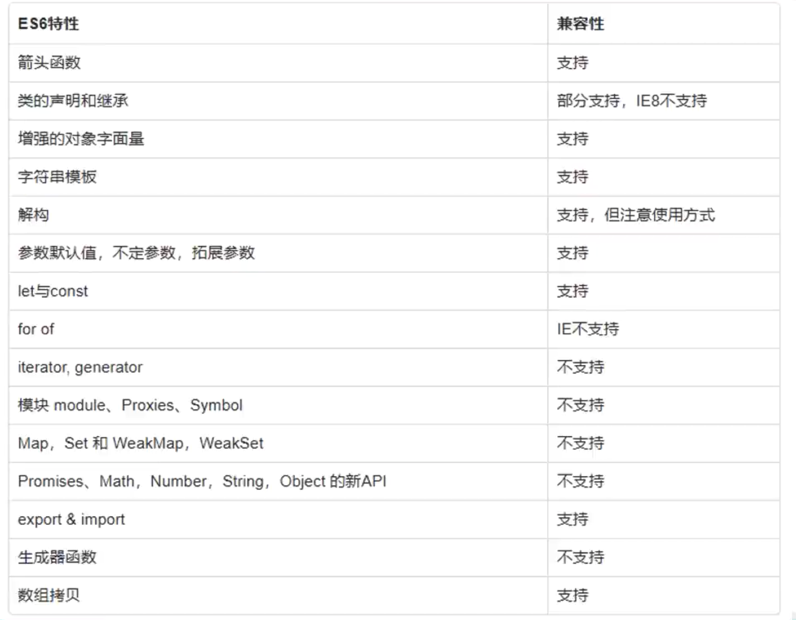

# 使用babel提前编译解决兼容性问题

## 安装babel-cli

```bash
npm i -g babel-cli
```

```javascript
// index.js
let a = 10;
let b = 20;
console.log(a + b);
```
验证安装

```bash
babel-node index.js
```

## 配置babel

> ./babelrc

```json
{
    "presets": ["es2015", "stage-2"],
    "plugins": ["transform-runtime"]
}
```

+ `presets`：设置转码规则
+ `plugins`：设置插件

安装所需的工具

```bash
npm install babel-core babel-preset-es2015 babel-plugin-transform-runtime babel-preset-stage-2 --save-dev
```

修改`package.json`

```json
"scripts":{
  "build":"babel src -w -d lib"
}
```

> 编译这个 `src` 目录，并将其输出到 `lib` 目录。

```bash
mkdir src
mkdir lib
```

> 手动新建这两个目录，不然报错

启动 babel 项目

```bash
npm run build
```

## ES6新特性在babel下的兼容性列表



